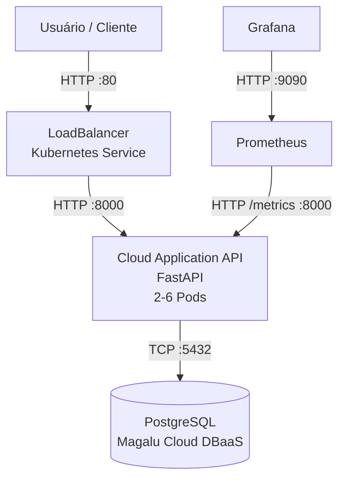

**Aluno:** Rodrigo Tognetta (Tog)

**Repositório do Projeto:** https://github.com/togtec/move-tech-cloud-application-comp-6

## 1. Inventário de Recursos
### 1.1 VM
**Provedor:** Magalu Cloud

**Nome da Instância:** vm-k3s-cluster

**Região/zona:** br-se1-a

**Configuração:** 1vCPU | 4GB RAM | 10GB Disco | Ubuntu 24.04 LTS

**IP público:** 201.23.66.65

**Custo estimado**: R$ 72,99/mês (R$ 0,1000/hora)

### 1.2 Banco de dados
**Tipo:** DBaaS Magalu Cloud

**Nome da Instância:** vm2-k3s-cluster-db

**Banco:** PostgreSQL 15

**Zona:**   br-se1-a

**Configuração:** 1 CPU	| 4 GB | 20 GB | 15000 IOPS

**Custo estimado**: R$ R$ 94,22/mês (R$ 0,1291)

### 1.3 cluster
Tipo: K3S

LoadBalancer: 201.23.66.65:80

Service: cloud-application

## 2. Escalabilidade
minReplicas: 2

maxReplicas: 6

Gatilho HPA: CPU > 70%

## 3. Estilo Arquitetural
Monólito modular implantado como container.

## 4. Observabilidade
http://201.23.66.65:8080      (Grafana)

## 5. Requisitos Não-Funcionais (RNFs)
**Disponibilidade:** Alvo de 99,5% mensal, monitorado por meio da disponibilidade das probes e da taxa de erros HTTP 5xx observada no Grafana.

**Latência:** Alvo de P95 ≤ 500 ms para as requisições da aplicação. Esse SLO é validado por testes de carga utilizando k6 e acompanhado por rota no Grafana.

**Vazão:** Alvo de 10 RPS (requisições por segundo) sob a carga esperada. A capacidade é validada por testes de carga com k6, considerando o comportamento da aplicação durante o patamar de carga definido.

**Custo:** R$ 167.21 por mês (VM + Banco)  

## 6. Diagrama C2 — Contêineres

